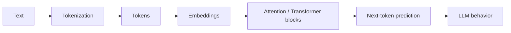

# S0 — Transformers & Large Language Models

This wiki turns the first lecture into a clear, diagram-heavy study guide.

The goal is simple: understand how modern language models work, starting from plain text and ending with the Transformer architecture that powers many large language models.

## What this lecture covers

- What the class is about
- How NLP and language modeling evolved
- Tokenization
- Token representations
- Word2Vec
- RNNs and LSTMs
- Attention
- Self-attention
- The Transformer architecture
- A basic end-to-end example
- How to prepare for exams

## One-paragraph mental model

A model does not understand text directly. It understands numbers.

First, text is split into tokens. Then tokens are represented as vectors. Early methods like Word2Vec learned useful word vectors, but they could not capture context well. RNNs added context using a hidden state, but they struggled with long dependencies and were slow to train. Attention solved part of this problem by letting tokens look directly at other tokens. The Transformer architecture uses this idea through self-attention, feed-forward networks, position information, and autoregressive generation.

## Core pipeline



## Wiki map

| Page | What it covers |
|---|---|
| [1. Class Overview](01-Class-Overview.md) | Goals, audience, prerequisites, logistics, exams |
| [2. Timeline](02-Timeline.md) | How we went from RNNs to Transformers to LLM agents |
| [3. Tokenization](03-Tokenization.md) | Tokens, vocabularies, BPE, special tokens |
| [4. Token Representations and Word2Vec](04-Token-Representations-Word2Vec.md) | One-hot encodings, embeddings, Word2Vec |
| [5. RNN and LSTM](05-RNN-and-LSTM.md) | Hidden states, sequential modeling, limitations |
| [6. Attention and Self-Attention](06-Attention-and-Self-Attention.md) | QKV, dot-product attention, scaled softmax |
| [7. Transformer Architecture](07-Transformer-Architecture.md) | Encoder, decoder, position encoding, blocks, tricks |
| [8. End-to-End Example](08-End-to-End-Example.md) | How input becomes output step by step |
| [9. Exams and Studying](09-Exams-and-Studying.md) | Exam scope, high-yield concepts, study advice |
| [10. Glossary](10-Glossary.md) | Quick definitions of key terms |

## Most important formula

```text
Attention(Q, K, V) = softmax((Q K^T) / sqrt(d_k)) V
```

This is the core operation behind self-attention.

- `Q` = queries
- `K` = keys
- `V` = values
- `d_k` = key dimension
- `softmax` turns scores into weights that sum to 1

## How to use this wiki

1. Start with [1. Class Overview](01-Class-Overview.md)
2. Read in order
3. Use the [Glossary](10-Glossary.md) when a term feels unfamiliar
4. Use [9. Exams and Studying](09-Exams-and-Studying.md) before tests

[← Back to Home](Home.md)
